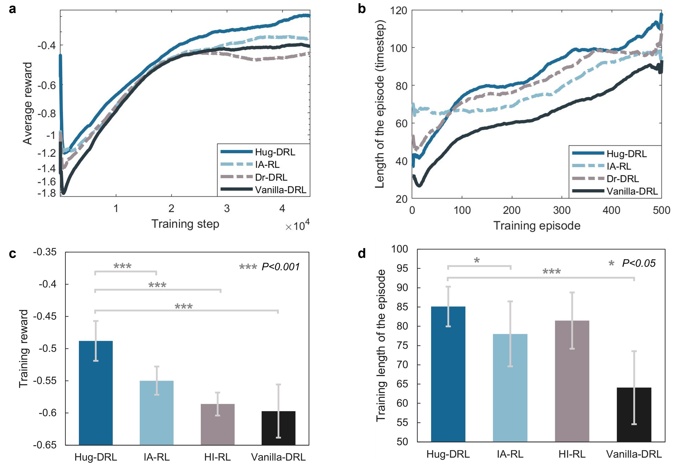

# Human-in-the-loop Deep Reinforcement Learning (Hug-DRL)

This repo is the implementation of the paper "Toward human-in-the-loop AI: Enhancing deep reinforcement learning via real-time human guidance for autonomous driving".

[**Toward human-in-the-loop AI: Enhancing deep reinforcement learning via real-time human guidance for autonomous driving**](https://www.sciencedirect.com/science/article/pii/S2095809922004878) 
> [Jingda Wu](https://scholar.google.com/citations?user=icu-ZFAAAAAJ&hl=en), [Zhiyu Huang](https://scholar.google.com/citations?user=aLZEVCsAAAAJ&hl=en), [Zhongxu Hu](https://scholar.google.com/citations?user=E02VCLEAAAAJ&hl=en), [Chen Lv](https://scholar.google.com/citations?user=UKVs2CEAAAAJ&hl=en) 

## Getting started
1. Install the CARLA simulator (0.9.7), with referring to
https://carla.readthedocs.io/en/latest/start_quickstart/#a-debian-carla-installation

2. Install the dependent package
```shell
pip install -r requirements.txt
```
3. Run the training procedure
```
python train_offline.py
```

## Training performance of different algorithms



## Reference
If you find this repo to be useful in your research, please consider citing our work
```
@article{WU2022,
title = {Toward human-in-the-loop AI: Enhancing deep reinforcement learning via real-time human guidance for autonomous driving},
journal = {Engineering},
year = {2022},
issn = {2095-8099},
doi = {https://doi.org/10.1016/j.eng.2022.05.017},
author = {Jingda Wu and Zhiyu Huang and Zhongxu Hu and Chen Lv},
}
```

## License
This repo is released under GNU GPLv3 License.
